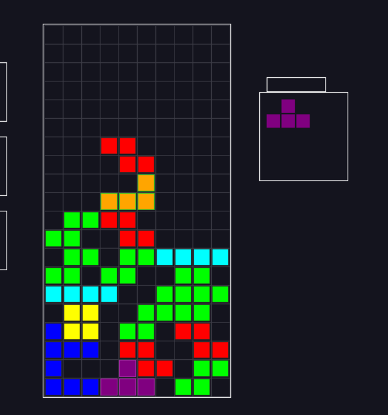

# 🎮 TETRIS - Documentation Complète


---


## 📋 Table des matières
1. [Architecture du Projet](#architecture)
3. [Structure des Fichiers](#structure)
4. [Installation et Compilation](#installation)
5. [Logique du Jeu](#logique)

---

## 🏗️ Architecture du Projet {#architecture}

```
tetris/
├── src/
│   ├── main.c           # Point d'entrée, boucle principale
│   ├── list.c           # Implémentation des listes chaînées
│   ├── pieces.c         # Gestion des pièces Tetris (tetrominos)
│   ├── game.c           # Logique du jeu (collision, rotation, lignes)
│   └── render.c         # Rendu graphique SDL3
├── include/
│   ├── list.h           # Interface des listes chaînées
│   ├── pieces.h         # Définitions des pièces
│   ├── game.h           # Interface de la logique de jeu
│   └── render.h         # Interface du rendu
├── Makefile             # Script de compilation
└── README.md            # Ce fichier
```

---


## 📁 Structure des Fichiers Détaillée {#structure}

### 1. `include/list.h` - Interface des Listes

```c
typedef struct Block {
    int x;              // Position X (0-9)
    int y;              // Position Y (0-19)
    SDL_Color color;    // Couleur du bloc
    struct Block *next; // Pointeur vers le bloc suivant
} Block;

typedef struct BlockList {
    Block *head;        // Premier élément
    int count;          // Nombre d'éléments
} BlockList;
```

**Opérations clés:**
- `list_create()` - Crée une nouvelle liste vide
- `list_add()` - Ajoute un bloc à la fin
- `list_remove()` - Supprime un bloc spécifique
- `list_find()` - Recherche un bloc par position
- `list_destroy()` - Libère toute la mémoire

### 2. `include/pieces.h` - Définition des Pièces

```c
typedef enum {
    PIECE_I,  // Ligne droite  ████
    PIECE_O,  // Carré         ██
    PIECE_T,  // T             ██
    PIECE_S,  // S zigzag      ███
    PIECE_Z,  // Z zigzag       ██
    PIECE_J,  // J              ███
    PIECE_L   // L             ███
} PieceType;

typedef struct {
    BlockList *blocks;  // Liste des 4 blocs
    PieceType type;
    int rotation;       // 0, 90, 180, 270
} Piece;
```

### 3. `include/game.h` - Logique du Jeu

```c
typedef struct {
    BlockList *fixed_blocks;    // Blocs fixés dans la grille
    Piece *current_piece;       // Pièce en mouvement
    Piece *next_piece;          // Prochaine pièce
    int score;
    int level;
    bool game_over;
} GameState;
```

**Fonctions principales:**
- `game_init()` - Initialise le jeu
- `game_update()` - Met à jour la logique (gravité, collisions)
- `game_move_piece()` - Déplace la pièce (gauche/droite)
- `game_rotate_piece()` - Rotation de la pièce
- `game_check_lines()` - Détecte et supprime les lignes complètes
- `game_fix_piece()` - Fixe la pièce dans la grille

---

## 🛠️ Installation et Compilation {#installation}

### Prérequis

**Ubuntu/Debian:**
```bash
sudo apt-get update
sudo apt-get install build-essential libsdl3-dev
```

**macOS:**
```bash
brew install sdl3
```

**Windows (MSYS2):**
```bash
pacman -S mingw-w64-x86_64-SDL3
```

### Compilation

```bash
# Créer les dossiers nécessaires
mkdir -p obj

# Compiler le projet
make

# Lancer le jeu
make run

# Nettoyer
make clean
```

---

## 🎯 Logique du Jeu Expliquée {#logique}

### Boucle Principale (main.c)

```
INITIALISATION
    ↓
┌─────────────────┐
│  BOUCLE DE JEU  │
├─────────────────┤
│ 1. Gestion Input│ ← Clavier (←, →, ↓, ESPACE)
│ 2. Mise à jour  │ ← Gravité, Collisions
│ 3. Rendu        │ ← Affichage SDL3
└─────────────────┘
    ↓
GAME OVER / QUIT
```

### Contrôles du Jeu

- **←** : Déplacer à gauche
- **→** : Déplacer à droite
- **↓** : Descente rapide
- **ESPACE** : Rotation horaire
- **P** : Pause
- **ESC** : Quitter
---
  



---


## 🚀 Extensions Possibles

1. **Hard Drop** - Faire tomber instantanément
2. **Hold** - Garder une pièce en réserve
3. **Ghost Piece** - Aperçu de la position finale
4. **Combo System** - Bonus pour lignes multiples
5. **Effets visuels** - Particules, flash sur ligne complète

---

## 📚 Ressources

- [SDL3 Documentation](https://wiki.libsdl.org/SDL3/FrontPage)
- [Tetris Guideline](https://tetris.wiki/Tetris_Guideline)
- Cours sur les listes chaînées en C

---

